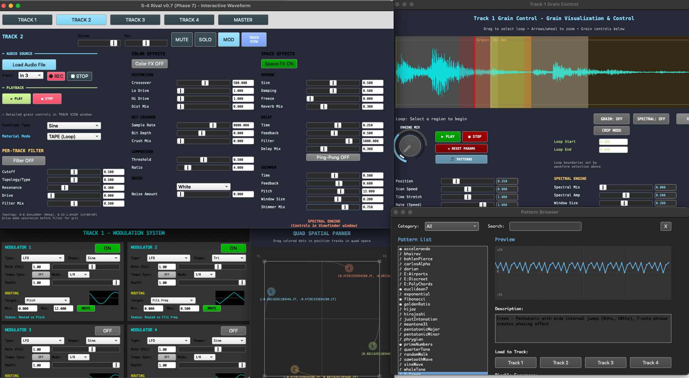

# BEARULATOR: Granular Synthesis Workstation



This is a 4-track granular synthesis sampler. Experimenting with Claude Code and Google Gemini to see how quickly I can progress the codebase while learning very little sclang and achieving what I want. Starting goal was to emulate popular granular synth *Torso S4*. Soon after starting I  realized the flexibility of Supercollider presents opportunity for much more synth than the Torso unit, especially running on a Mac M4 with 24gb of ram. Given the speed I was able to work using LLM coding assistants,  I decided to create this open ended project with several modular components that already function as a granular synth for my studio. I've been making updates as the Claude pro subscription allows -- credits re-up on Thursday morning, and I typically run out by Sunday. 

## Active TODOs

- [ ] Create a new TODO list.

---

## SYSTEM REQUIREMENTS

### Hardware & IO
- [x] **Compute Memory:** ~2GB RAM allocation (8192 * 256 KB) for buffers/real-time audio
- [x] **Audio Inputs:** 8-channel input configuration (optimized for MOTU Mk5)
- [x] **Audio Outputs:** Quad Speaker Output (FL/FR/RL/RR) or Stereo switchable
- [x] **MIDI Controller:** Dedicated mapping for Arturia KeyStep Pro (Knobs, Mod Strip, Keyboard)

### Software Dependency
- [x] **SuperCollider:** Core execution environment (Version 3.13+ recommended for M4)
- [x] **SC3 Plugins:** Community extension pack (Required for Analog Filters, Membrames, & Advanced FX)
  - On Apple Silicon, ensure you download the **signed** release of SC3 Plugins to avoid macOS security gatekeeper issues.
    1.  Go to the [SC3 Plugins Releases](https://github.com/supercollider/sc3-plugins/releases).
    2.  Download the latest macOS release (usually `sc3-plugins-Version-macOS.zip`).
    3.  Place the downloaded `SC3Plugins` folder into:
    `~/Library/Application Support/SuperCollider/Extensions/`
    *(You may need to create the `Extensions` folder if it doesn't exist).*
    4.  Recompile the class library in SuperCollider (`Cmd+Shift+L`).
- [x] **Directory Structure:** Requires `core/`, `gui/`, `material/`, `io/`, `presets/`, and `samples/` relative to `main.scd`
## CURRENT FEATURE SET (Phase 1-17)

### Audio Engines (Per Track)
- [x] **Hybrid Architecture:** Fade between Granular, Spectral, and Direct engines via "Engine Mix"
- [x] **Quad Granular Engine:** 128 grains per track (512 total) with size, density, and jitter controls (Phase 1)
- [x] **Spectral Engine (Warp1):** Spectral smearing, freezing, and independent pitch shifting (Phase 8)
- [x] **Direct Playback Engine:** Standard looping sample player running in parallel (Phase 15)
- [x] **Material Modes:** Tape, Poly, and Live input modes (Phase 6)

### Sampling & Recording
- [x] **Live Loop Recording:** Always-on 4-second rolling buffer recording from hardware inputs (Phase 1)
- [x] **Spectral Photobooth:** Capture 4 seconds of Spectral Engine texture to buffer for reuse (Phase 17)
- [x] **Crop Mode:** Non-destructive loop windowing and buffer cropping via GUI (Phase 15)

### Effects & Processing
- [x] **Per-Track "Color" FX:** Distortion, Bit Crusher, Compressor, and Noise generation (Phase 3)
- [x] **Per-Track "Space" FX:** Reverb (with freeze), Ping-Pong Delay, and Shimmer (Phase 3)
- [x] **Tape Degradation:** "Wow & Flutter" emulation for vintage tape pitch drift (Phase 16)
- [x] **Master Bus Resonator:** 48-band morphing filter shared across tracks (Phase 4)

### Modulation
- [x] **Modulation System:** 4 Modulators per track (LFOs, envelope followers) (Phase 5)
- [x] **Mosaic Mode:** Cross-modulation (Track A envelope modulates Track B parameter) (Phase 16)

### Interface & Visualization
- [x] **Waveform Viewfinder:** Real-time waveform display with drag-to-select looping (Phase 7)
- [x] **Visual Overlays:** Real-time playheads for Grain, Spectral, and Recording engines (Phase 15)
- [x] **Quad Panner:** Dedicated GUI for positioning tracks in 4-channel spatial field (Phase 12)
- [x] **Spectrum Analyzer:** FabFilter-style frequency analyzer on master output (Phase 15)

## THE M4 ULTIMATE SPEC (Phase 9+)

### Visual Flash (Doom Material Enhanced)
- [x] **FFT Spectrogram Overlay:** Real-time frequency heatmap behind the waveform **(Phase 11)**
- [x] **Grain Pulse Animation:** Visual "pings" on the viewfinder where grains are triggered **(Phase 11)**
- [ ] **Neon Glow Rendering:** Hardware-accelerated "glow" effects for the playhead and loop regions

### Overlooked Audio Components
- [x] **Dual-Topology Analog-Modeled Filter (Per Track):** **(Phase 10)**
  - ZDF (Zero-Delay Feedback) Ladder Filter - Liquid resonance with self-oscillation
  - State Variable Filter (SVF) - LP/HP/BP morph capability
  - Pre-Filter Drive Stage - Nonlinear saturation (.tanh) for filter "grit"
  - Bass Loss Compensation - Maintains low-end at high resonance
- [ ] **Audio-Rate Modulation:** Upgrade from 750Hz control-rate to 48kHz audio-rate
- [ ] **Transient Bypass Logic:** Keeps drum transients sharp during heavy spectral stretching
- [x] **Phase-Aligned Granulation:** Prevents phase-cancellation in low-frequency textures **(Phase 9)**
- [x] **Master Bus "Glue" Compressor:** Final stage compressor to bond the 4 tracks together **(Phase 9)**

## THE M4 ULTIMATE SPEC (Phase 9+)

### Visual Flash (Doom Material Enhanced)
- [x] **FFT Spectrogram Overlay:** Real-time frequency heatmap behind the waveform **(Phase 11)**
- [x] **Grain Pulse Animation:** Visual "pings" on the viewfinder where grains are triggered **(Phase 11 )**
- [ ] **Neon Glow Rendering:** Hardware-accelerated "glow" effects for the playhead and loop regions

### Overlooked Audio Components
- [x] **Dual-Topology Analog-Modeled Filter (Per Track):** **(Phase 10)**
  - ZDF (Zero-Delay Feedback) Ladder Filter - Liquid resonance with self-oscillation
  - State Variable Filter (SVF) - LP/HP/BP morph capability
  - Pre-Filter Drive Stage - Nonlinear saturation (.tanh) for filter "grit"
  - Bass Loss Compensation - Maintains low-end at high resonance
- [ ] **Audio-Rate Modulation:** Upgrade from 750Hz control-rate to 48kHz audio-rate
- [ ] **Transient Bypass Logic:** Keeps drum transients sharp during heavy spectral stretching
- [x] **Phase-Aligned Granulation:** Prevents phase-cancellation in low-frequency textures **(Phase 9)**
- [x] **Master Bus "Glue" Compressor:** Final stage compressor to bond the 4 tracks together **(Phase 9)**

---

## **HARDWARE PLATFORM**

**Target:** Mac Mini M4
**RAM:** 24 GB
**CPU Usage:** ~25% at full capacity (75% headroom available!)
**Architecture:** Optimized for M4 single-core performance & high memory bandwidth

**Future Targets:**
- Headless Linux build (server deployment)
- Raspberry Pi stripped version (portable/embedded)

**Development Status:**Active development - Documentation evolving rapidly

**📖 For complete feature list, see [FEATURES.md](FEATURES.md)**

---

## QUICK START

### Step 1: Boot the SuperCollider Server

**IMPORTANT**: Before running `main.scd`, you need to boot the audio server. Different systems require different setups:

#### Mac (Built-in Audio)
```supercollider
// Default Mac audio - just boot it
s.boot;
```

####  Mac with Audio Interface (MOTU, Focusrite, etc.)
```supercollider
// Option 1: Use your interface as default
s.boot;

// Option 2: Explicitly select your interface
(
Server.default = Server.local;
s.options.device = "MOTU UltraLite mk4";  // <- Change to YOUR interface name
s.boot;
)

// To see all available devices:
ServerOptions.devices;
```

#### 🐧 Linux (JACK or ALSA)
```supercollider
// JACK (recommended for low latency)
(
Server.default = Server.local;
s.options.device = "JackRouter";
s.boot;
)

// ALSA (simpler setup)
s.boot;  // Uses default ALSA device
```

#### Windows (ASIO or MME)
```supercollider
// ASIO (recommended - low latency)
(
Server.default = Server.local;
s.options.device = "ASIO : Your Interface Name";  // e.g., "ASIO : Focusrite USB"
s.boot;
)

// To see all available devices:
ServerOptions.devices;
```

### Step 2: Wait for Boot Confirmation
Look for this in the Post window:
```
*** Welcome to SuperCollider 3.14.1 ***
Server 'localhost' running.
```

### Step 3: Run Main
```supercollider
// Execute this file
"main.scd".loadRelative;
```

The GUI will open automatically!

---

## WHAT YOU'RE LOOKING AT

### 4 Track Tabs
- **TRACK 1-4**: Full granular synthesis controls per track
  - Load audio files or record live input
  - Grain engine (size, overlap, position, pitch)
  - Color FX (distortion, bit crusher, compression, noise)
  - Space FX (reverb, delay, shimmer)
  - Loop window selector (drag waveform to set loop points)

### Master Tab
- **PLAY ALL / STOP ALL**: Global transport
- **GLOBAL SPEED**: Control pitch of all tracks at once
- **TRACK OVERVIEW**: Quick mix controls + VU meters
- **CPU MONITOR**: Keep it green!

---

## BASIC WORKFLOW

### 1. Load Audio into Track 1
1. Click **TRACK 1** tab
2. Click **Load Audio File**
3. Navigate to `samples/stock/` and load one of these:
   - **a11wlk01.wav** - "Columbia, this is Houston" (Apollo 11 mission audio)
   - **a11wlk01-44_1.aiff** - Same audio, different format
   - **SinedPink.aiff** - Synthetic test tone
4. Click **PLAY** to hear grains

**Pro tip**: The Apollo 11 sample is PERFECT for granular processing - try tiny grain sizes (0.01s) for a frozen space transmission texture!

### 2. Sculpt the Grains
- **Grain Size**: How long each grain is (0.001s - 60s)
- **Overlap**: How many grains play at once (1-128)
- **Position**: Where in the buffer to read from (0-1)
- **Pitch**: Transpose in semitones (-24 to +24)

### 3. Set Loop Window
- Drag on the waveform display to select a region
- The grain engine will only play from this region
- Use arrow keys or mouse wheel to zoom

### 4. Add Effects
- **Color FX ON**: Enable distortion/crusher/noise chain
- **Space FX ON**: Enable reverb/delay/shimmer

### 5. Mix & Monitor
- Go to **MASTER** tab
- Adjust track volumes
- Watch VU meters (aim for green/yellow, avoid red)
- Keep CPU below 50% average

### 6. Save Your Work (Phase 14!)
```supercollider
// Save current state as a preset
~presets.save("mySound");

// Load it later
~presets.load("mySound");

// Or try example presets
"examples/preset-examples.scd".loadRelative;  // Creates 10 example presets
~presets.list;                                  // See all presets
~presets.load("ambient_pad");                   // Load ambient preset
```

---

## ESSENTIAL SC COMMANDS

See `generic-commands.scd` for a full cheat sheet. Here are the must-knows:

### Emergency Stop
```supercollider
Cmd-.    // Mac
Ctrl-.   // Windows/Linux
// Kills all sound immediately!
```

### Server Management
```supercollider
s.boot;          // Start server
s.reboot;        // Restart clean
s.quit;          // Shut down
s.freeAll;       // Kill all synths but keep server running
```

### Monitoring
```supercollider
s.meter;         // Audio level meters
s.scope;         // Oscilloscope
s.plotTree;      // See all running synths
s.avgCPU;        // Check CPU usage
```

### Volume Control
```supercollider
s.volume = -20;  // Set output volume in dB
s.mute;          // Mute all output
s.unmute;        // Unmute
```

---

## MATERIAL MODES (Phase 6)

Each track has 3 material modes:

1. **TAPE (Loop)**: Classic looping granular synthesis
   - Good for: Ambient textures, pitch shifting loops

2. **POLY (Sample)**: One-shot sample playback per grain
   - Good for: Rhythmic glitches, stutters

3. **LIVE (Input)**: Real-time granulation of live audio input
   - Good for: Live processing, feedback loops

---

##  TROUBLESHOOTING

### No Sound?
1. Check server is booted: `s.serverRunning`
2. Check volume isn't muted: `s.volume`
3. Hit **PLAY** button (tracks start STOPPED by default)
4. Check audio interface is selected correctly
5. Verify your interface is powered on and connected

### Audio Crackling?
1. Check CPU usage (Master tab)
2. Increase server buffer size:
   ```supercollider
   s.quit;
   s.options.blockSize = 256;  // or 512, 1024
   s.boot;
   ```

### GUI Looks Weird?
- Make sure you have **DejaVu Sans Mono** font installed
- Or edit `gui/four-track-view.scd` to use a different monospace font

### Recording Too Quiet?
- Input is boosted 3x automatically
- Check your interface's input gain
- Try the Input selector (In 1-8) to choose the right channel

---

## PROJECT STRUCTURE

```
granular/
├── main.scd                  # Start here!
├── generic-commands.scd      # SC command reference
├── core/                     # Engine modules
│   ├── grain-engine.scd
│   ├── track-manager.scd
│   ├── buffer-recorder.scd
│   └── ...
├── gui/                      # Visual interface
│   ├── four-track-view.scd
│   ├── viewfinder.scd
│   └── ...
├── samples/                  # Audio samples
│   ├── stock/               # Included samples (Apollo 11, test tones)
│   ├── drones/              # Put your drone samples here
│   ├── percussion/          # Put your percussion here
│   └── field-recordings/    # Put your field recordings here
└── docs/                     # Development notes
```

---

## STOCK SAMPLES

The `samples/stock/` folder includes some great starter material:

### Apollo 11 Mission Audio
- **a11wlk01-44_1k.aiff** - "Columbia, this is Houston..."
- Classic mission control transmission
- Perfect for granular processing - rich textures with voice, static, and space
- Try these settings:
  - Grain Size: 0.01s → frozen space transmission
  - Position: 0.3-0.7 → scan through the transmission
  - Pitch: -12 → deep space drone
  - Reverb Mix: 0.8 + Freeze: 1.0 → infinite space

### Test Tone
- **SinedPink.aiff** - Sine wave + pink noise blend
- Good for testing effects and understanding parameters
- Less exciting than Apollo 11 but useful for calibration

**Want more samples?** Drop any WAV/AIFF files into the samples folders!

---

## LEARNING PATH

1. **Start Simple**: Load one sample, hit play, adjust grain size
2. **Explore Position**: Move the position slider while playing
3. **Try Loop Windows**: Select different regions of your sample
4. **Add Pitch**: Transpose up/down while playing
5. **Layer Tracks**: Load different samples on tracks 2-4
6. **Mix Effects**: Start with reverb mix, then try delay
7. **Get Weird**: Crank the jitter, add noise, freeze the reverb

---

## ADVANCED FEATURES

### Modulation System (Phase 5)
- Click **MOD** button in any track
- 4 modulators per track (LFO, Envelope Follower, Random, etc.)
- Route to any parameter (pitch, grain size, position, etc.)

### Viewfinder (Phase 7)
- Click **LOOP VIEW** for popup waveform editor
- Zoom with arrow keys or mouse wheel
- Drag to select precise loop regions
- Works with both loaded files AND recorded buffers
- **Play/Stop buttons** control track playback directly from viewfinder

### Recording Viewfinder (Phase 12) 🎤
- Separate window for live audio recording
- Real-time waveform visualization
- Select regions with mouse drag
- Send selected regions to any of 4 granulator tracks
- 8-channel input support (MOTU Mk5 compatible)
- Transport controls (Record/Stop/Play)

**Usage:**
```supercollider
~recordingViewfinder.createWindow();  // Open recording window
// 1. Select input channel (In 1-8)
// 2. Press REC to record
// 3. Press STOP when done
// 4. Drag on waveform to select region
// 5. Choose target track (1-4)
// 6. Press "Send to Track"
```

### MIDI Control (Phase 12)
**KeyStep Pro Integration:**
- 5 encoder mappings (customizable CC assignments)
- Polyphonic note triggering (4 MIDI channels → 4 tracks)
- Velocity-sensitive grain density
- Note number → playback rate (C3 = 1.0x, C4 = 2.0x)
- Visual feedback (green pulses on note events, cyan overlays on CC changes)

**Default Encoder Mappings:**
- CC 74 → Filter Cutoff (Track 1)
- CC 71 → Grain Size (Track 1)
- CC 76 → Overlap/Density (Track 1)
- CC 77 → Spectral Mix (Track 1)
- CC 78 → Filter Drive (Track 1)

**Remap encoders:**
```supercollider
~s4MIDIMapping.mapCC(74, \reverbMix, 0);  // CC 74 → Reverb Mix on Track 1
```

### Quad Speaker Output (Phase 12) 🔊
**4-Speaker Spatial Audio System**

**Speaker Layout (MOTU outputs 1-4):**
```
  FL (Out 0)     FR (Out 1)
      [  X  Y  ]
  RL (Out 2)     RR (Out 3)
```

**Features:**
- 2D spatial positioning (X/Y coordinates)
- Equal-power quad panning
- Interactive spatial GUI with drag-and-drop positioning
- Per-track spatial control
- Real-time spatial movement

**Setup:**
1. Load quad mix bus:
   ```supercollider
   "core/mix-bus-quad.scd".loadRelative;
   ```

2. Open spatial panner GUI:
   ```supercollider
   ~quadPanner = ~s4QuadPanner.value(~trackManager);
   ~quadPanner.createWindow();
   ```

3. Position tracks by dragging colored dots in the 2D field

**Manual Control:**
```supercollider
~trackManager.setQuadPosition(0, -0.5, -0.5);  // Track 1: Front-Left
~trackManager.setQuadPosition(1,  0.5, -0.5);  // Track 2: Front-Right
~trackManager.setQuadPosition(2, -0.5,  0.5);  // Track 3: Rear-Left
~trackManager.setQuadPosition(3,  0.5,  0.5);  // Track 4: Rear-Right
```

**Preset Positions:**
- **Corners**: Distribute tracks to the 4 corners of the quad field
- **Front Row**: All tracks in front (good for live performance)
- **Circle**: Evenly distributed around the perimeter
- **Center All**: Collapse all tracks to center

**Test Quad Output:**
```supercollider
"tests/quad-speaker-test.scd".loadRelative;  // Runs rotation test + manual control
```

**Spatial Effects Ideas:**
- **Rotating Cloud**: Slowly rotate grain position in circle
- **Ping-Pong Quad**: Bounce grains between all 4 speakers
- **Spatial Granulation**: Position each grain randomly in quad field
- **Spectral Spread**: Low frequencies in front, high in rear
- **Dynamic Space**: Modulate X/Y position with LFOs

---

## (
// --- 1. MIDI SETUP ---
MIDIClient.init;
// Output 1: Digitone (Pads/Bass/Rain)
m = MIDIOut.newByName("Elektron Digitone", "Elektron Digitone");
m.latency = 0;

// Output 2: KeyStep Pro (Modular Click/Gravel)
k = MIDIOut.newByName("KeyStep Pro", "KeyStep Pro");
k.latency = 0;

"--- MIDI LINKED: Digitone + KeyStep Pro ---".postln;

// --- 2. GLOBAL CONSTANTS ---
Pdefn(\masterRoot, 0); // C Dorian root
~phrygianPool = [[5, 6], [8], [10, 11], [6, 8, 10], [11]];

// --- 3. SHARED RHYTHM GENERATOR ---
// FIXED: properly collecting Rests so they don't crash the scheduler
~gravelTime = Pwrand([
    Pwhite(2.0, 8.0, 1),           // Sparse
    Pseq([0.1, 0.15, 0.2], 1),     // Burst
    // The Fix: Generate number first, THEN wrap in Rest
    Pwhite(20.0, 60.0, 1).collect { |d| Rest(d) } 
], [0.6, 0.3, 0.1], inf);


// --- 4. LAYER DEFINITIONS ---

// LAYER 1: BASS (Digitone)
Pdef(\bass_layer,
    Pbind(
        \type, \midi, \midiout, m, \chan, 0,
        \root, Pdefn(\masterRoot), \scale, Scale.dorian, \octave, 2,
        \degree, Pwrand([0, 4, [1, 2], [0, 1]], [0.3, 0.6, 0.1, 0.1], inf),
        \sustain, Pwhite(10.0, 25.0, inf),
        \dur, Pkey(\sustain) + Pwhite(45.0, 90.0, inf),
        \amp, Pwhite(0.6, 0.9, inf)
    )
);

// LAYER 2: GHOST (Digitone)
Pdef(\ghost_layer,
    Pbind(
        \type, \midi, \midiout, m, \chan, 1,
        \root, Pdefn(\masterRoot), \scale, Scale.dorian,
        \dur, Pwhite(6.0, 36.0, inf),
        \legato, Pwrand([0.99, 1.2], [0.95, 0.05], inf),
        \degree, Pwrand([[-7, 0], [-2, 0], [-7, -5], [-14, -4, 0]], [0.4, 0.3, 0.2, 0.1], inf),
        \amp, Pwhite(0.3, 0.5, inf)
    )
);

// LAYER 3: RAIN (Digitone)
// FIXED: This was the layer causing the crash
Pdef(\rain_layer,
    Pbind(
        \type, \midi, \midiout, m, \chan, 2,
        \root, 5, \scale, Scale.phrygian, \octave, Pwrand([5, 6, 7], [0.5, 0.3, 0.2], inf),
        \degree, Pfunc({ ~phrygianPool.choose }),
        \dur, Pwrand([
            Pwhite(3.0, 8.0, 1),
            Pseq([0.25, 0.5, 0.25], 1),
            // CRITICAL FIX HERE:
            Pwhite(30.0, 90.0, 1).collect { |d| Rest(d) } 
        ], [0.7, 0.2, 0.1], inf),
        \sustain, Pwhite(0.05, 0.3, inf),
        \amp, Pwhite(0.3, 0.5, inf)
    )
);

// LAYER 4a: DIGITONE TEXTURE (CC Data)
Pdef(\digitone_glitch,
    Pbind(
        \type, \midi, \midiout, m, \chan, 3, 
        \midicmd, \control,
        \ctlNum, Pwrand([74, 71, 16], [0.6, 0.3, 0.1], inf),
        \control, Pwrand([Pwhite(80, 127, 1), Pwhite(30, 60, 1), 0], [0.7, 0.2, 0.1], inf),
        \dur, ~gravelTime // Uses the shared rhythm logic
    )
);

// LAYER 4b: MODULAR GRAVEL (Physical Triggers)
Pdef(\modular_gravel,
    Pbind(
        \type, \midi, 
        \midiout, k,      // Send to KEYSTEP
        \chan, 0,         // Track 1
        \dur, ~gravelTime, 
        \midinote, Pwrand([36, 48, 84, 96], [0.4, 0.4, 0.1, 0.1], inf),
        \amp, Pwhite(0.4, 1.0),
        \legato, 0.1
    )
);

// --- 5. EXECUTE ---
Pdef(\capricornFull, Ppar([
    Pdef(\bass_layer),
    Pdef(\ghost_layer),
    Pdef(\rain_layer),
    Pdef(\digitone_glitch), 
    Pdef(\modular_gravel)   
])).play;

"--- CAPRICORN SYSTEM: HYBRID MODE (FIXED) ---".postln;
)DEVELOPMENT STATUS

**Current Phase:** 17 (48-Band Resonator Complete)
**Last Updated:** Phase 17 - 48-Band Morphing Resonator (Jan 18, 2026)

**Active TODO List:** See `TODO.md` for current tasks

### Phase 17 Features (NEW!)

**48-Band Morphing Resonator (Torso S-4 Style)**
- DynKlank-based resonant filter bank with 48 harmonic bands
- Morph algorithm: `Freq[i] = BaseFreq * ((i + 1) ** Morph)`
- 4 macro knobs: Freq, Morph, Damp, Decay
- D Minor scale quantization toggle
- Stereo split mode (odd bands L, even bands R)
- Karplus-Strong style feedback with safety limiting
- Available on Master bus AND per-track popup windows
- Modulation targets for LFO control (resFreq, resMorph, resDamp, resDecay, resFeedback, resMix)

**Usage:**
```supercollider
// Open master resonator window
~resonatorWindow.open(\master, "Master");

// Open per-track resonator (click RESONATOR button in track tab)
~resonatorWindow.open(\track1, "Track 1");

// Standalone test mode (pink noise input)
"core/resonator-48band.scd".loadRelative;
```

**Spectral Photobooth**
- Snapshot-based spectral freezing effect
- Capture and hold spectral content for infinite sustain

**Wow & Flutter Tape Degradation**
- Authentic tape machine pitch wobble
- Adjustable wow (slow drift) and flutter (fast wobble) amounts
- Adds vintage character to any track

### Phase 16 Features
- KeyStep Pro multi-track routing (control multiple tracks from one keyboard)
- Two Captains engine toggle conflict fix
- Performance macro sliders in Master tab

### Completed Phases (1-15)
- Core 4-track granular engine with TGrains
- Spectral engine with Warp1 time-stretching
- Per-track dual-topology filters (Ladder/SVF)
- Color FX chain (distortion, bitcrusher, compression)
- Space FX chain (reverb, delay, shimmer)
- 4-modulator system per track (audio-rate @ 48kHz)
- Interactive viewfinder with FFT spectrogram
- MIDI integration (KeyStep Pro)
- Recording viewfinder with region selection
- Quad speaker output (4-channel spatial)
- Preset save/load system
- Master bus glue compressor + brick-wall limiter

## KNOWN ISSUES

- Waveform display uses temp files for recorded buffers
- Modulation window is a separate popup (not integrated)
- **Engine switching in track viewer has visual bugs** (active development)
- Some GUI elements may overlap in Master tab (layout cleanup in progress)

---

## YES YES YES!

Granular synthesis is all about exploration.

- Try tiny grain sizes (0.001s) for frozen textures
- Try huge grain sizes (10s+) for slow morphing
- Crank overlap to 128 for dense clouds
- Use 1 overlap for clean playback
- Record your output and feed it back in!

Questions? Check `generic-commands.scd.`

<!-- Local Variables: -->
<!-- gptel-model: claude-haiku-4-5-20251001 -->
<!-- gptel--backend-name: "Claude-Haiku-4.5" -->
<!-- gptel-max-tokens: 6000 -->
<!-- gptel--bounds: nil -->
<!-- End: -->
